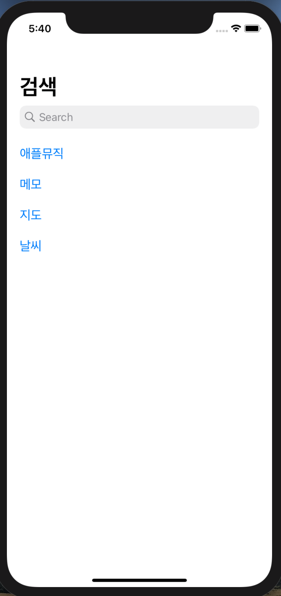

# MyAppStore App🍎

> 애플 Open API를 통해 AppStore 의 검색 페이지 구현
&nbsp;

### Index

- [기능](#기능)
- [설계](#설계)
- [trouble shooting](#trouble-shooting)
- [학습내용](#학습-내용)

---

<p float="left">
  
   
  
</p>

 &nbsp;

---

## 기능

- [키워드 검색](#키워드-검색)
- [검색 결과](#검색-결과)
- [검색어 저장](#검색어-저장)

### 키워드 검색

검색할 키워드로 검색하여 결과를 볼 수 있다


### 검색 결과

검색 결과의 디테일 정보를 확인할 수 있다


### 검색어 저장

저장했던 검색어를 저장하여 클릭시 다시 재검색 할 수 있다



---

## 설계

### View Controller 구성


&nbsp;

### AppStoreViewModel과 View - MVVM

#### SearchPageViewController, DetailViewController - AppStoreViewModel


- ViewModel class안에서 Closure 사용하여 data 변경사항 캐치 후 data binding 및 UI Update

&nbsp;

### Role

#### view

| class / struct               | Role                                                         |
| ---------------------------- | ------------------------------------------------------------ |
| `SearchPageViewController`   | AppStoreViewModel을 이용하여 받은 현재 검색 결과를 테이블뷰 상에 보여준다 |
| `DetailViewController`       | SearchPageViewController에서 넘겨 받은 viewModel의 값의 디테일 정보를 보여준다  |
| `AppStoreViewModel`          | Request Manager를 이용해 검색한 정보를 가져온다 |


#### Utilities

| class / struct          | Role                                                         |
| ----------------------- | ------------------------------------------------------------ |
| `Request Manager`       | URLSession을 이용하여 현재 검색어에 대한 정보를 요청함                  |
| `ImageCacheManager`     | NSCache 사용하여 이미지 Load 후 캐시에 저장하여 뷰가 보여질때마다 재요청 방지 |
| `UserDefaultsManager`   | UserDefaults 사용하여 검색한 검색어를 저장                           |
| `LogManager`            | 커스텀 Print를 사용하여 자세한 debug가 가능하도록 제공함                 |

&nbsp;

### 정보 받아오기 & 파싱하기 - 애플 앱스토어 Open API / URLSession / Codable

>  [애플 앱스토어 Open API](https://itunes.apple.com/search?entity=software&country=KR)

- [URLSession 학습한 내용](#url-loading-system)
- Codable
  - `AppStoreModel` 은 `Codable` protocol 을 준수
  - `JSONDecoder` 사용하여 변환함

&nbsp;

### 검색한 키워드 저장 - UserDefaults

- [UserDefaults 학습한 내용](#userDefaults)
- 마지막으로 검색한 검색어 저장 
- 저장된 검색어 클릭시 정보 재요청
- UserDefaultManager 를 이용해 저장될 key value 관리

&nbsp;

---

## Trouble Shooting

### 검색시 Load되는 앱의 ScreenShot 이미지가 View가 보여질때마다 재요청

- 문제상황
  - 검색시 테이블뷰의 이미지와 detailViewController의 스크린샷 이미지가 View가 보여질때마다 재요청되어 UI의 딜레이 생성
- 해결 방법 
  - NSCache
   - NSCache를 이용하여 이미지를 load하고 나서는 이미지캐시로 저장되어 재요청하지 않고 캐시에 저장하여 View가 보여질때마다 이를 반환하도록 구현
   - ImageCacheManager를 만들어 사용함
   
   ```swift
    class ImageCacheManager {
    
    static let nsCache = NSCache<NSString, UIImage>()
    
    static func load(with url: String, imageView: UIImageView) {
        let cacheKey = NSString(string: url)
        if let cachedImage = nsCache.object(forKey: cacheKey) {
            imageView.image = cachedImage
            return
        }
        guard let imageURL = URL(string: url) else {return}
        DispatchQueue.global().async {
            guard let imageData = try? Data(contentsOf: imageURL) else {return }
            let image = UIImage(data: imageData)
            DispatchQueue.main.async {
                imageView.image = image
                if let image = image {
                    nsCache.setObject(image, forKey: cacheKey)
                 }
             }
         }
      }
  }
  ```
&nbsp;
 
### 각 View에서 공통적으로 사용될 Rating Star View를 공통 Component화 

- 문제상황
  - Rating Star가 쓰이는 상황과 타이밍에 따라 별이 filled or empty 되어야 하고, 필요한 별의 갯수도 달라져야함
- 해결방법
  - 별의 Style을 Enum을 사용하여 지정해주고 각각의 type마다 RawValue를 지정해줌
  - init을 이용하여 Rating Star View가 사용되는 상황에 따라 style을 지정하고, 갯수를 count로 받도록 함 
  - API로 제공되는 평점 데이터를 받도록 setData 메서드를 활용하여 평점에 따라 filled Star의 갯수를 지정함
  
   &nbsp;
  
### 앱의 New Version 출시날짜를 현재 날짜 기준 몇일, 몇주, 몇년 전인지에 대해서 보여줌

- 문제상황
  - open API 에서 제공하는 값은 released Date의 String 값
  - 따라서, 현재 시간과 released Date 사이의 Time Gap을 구해야 함
- 해결방법
  - `TimeInterval`을 이용하여 Time Gap을 구하고 그 값을 기간의 조건에 따라 다르게 보여지도록 함
  
&nbsp;

---

## 학습 내용

### URL Loading System

> 표준 인터넷 프로토콜을 사용하여 서버와 url 로 소통하여, URL로 식별되는 자료에 접근할 수 있도록 한다
Loading은 비동기적으로 처리되기 때문에 앱의 응답속도를 유지하면서 data와 error를 처리할 수 있다.

#### URLSession 

> Url 로 request 를 보내거나 받는 일을 담당하는 객체
- 설정 : `URLSessionConfiguration` 3가지
  - Default : 기본적인 디스크 기반의 Session
  - Ephemeral : 어떠한 데이터도 저장하지 않는 Session
  - Background : 앱이 종료된 이후에도 통신이 이루어지는 Session
  
- `URLSession` instance 는 `URLSessionTask` 를 이용해 생성 
  - GET request 통해 데이터를 받아옴 : `URLSessionDataTask`
  - POST / PUT request 통해 파일을 업로드 : `URLSessionUploadTask`
  - 서버에서 파일을 다운로드 : `URLSessionDownloadTask`
  
- URLSession 이 데이터를 반환하는 두가지 방법 (비동기적으로 수행되므로, 끝남을 알리는 방법)
  1. completion handler - task 가 끝날 때 실행됨
  2. delegate 의 method 호출


#### URLComponents

> URL 을 구성하는 요소들
- queryItem property : URLQueryItem (name -value 짝으로 구성되어 URL 의 query 부분을 담당)

### 네트워크 타입

- request (요청)
- eponse (응답)

#### URLSession 활용한 data GET

- singleton 사용

```swift
let task = URLSession.shared.dataTask(with: url) {
	completion...
}
```

- Data : bytes or nil(error)
- reponse: reponse 의 구현체. HTTPURLReponse 로 타입 캐스팅하여 확인 및 사용가능
  - HTTPURLResponse의 status code를 이용해 현재 상태코드를 사용할 수 있다(status code: 200-300사이: 확인 및 진행/ 그 외의 코드범위 구획화하여 error 확인)
- error: error 발생시 값 있음. nil일때 success

- 네트워크 종료시 .resume()


### GCD (Grand Central Dispatch)

Thread 관련 작업d을 처리함
Closure로 표현된 특정작업을 특정 Queue에 올려 태우고, 이 Queue를 특정 thread에서 실행하는 작업을 수행함
비동기 수행을 원할 때, main queue(main flow) 말고 다른 수행 queue 로 작업을 보내고 싶을 때 사용

- Dispatch Queue
 - main(serial) : main thread 에서 처리하는 serial-queue, 모든 UI작업은 Main queue에서 수행해야 한다
 - global(concurrent) : 전체 시스템에 공유되는 concurrent queue, 작업의 우선순위를 사전에 정의한 QoS로 정해줌
 - sync : 동기 방식
 - async : 비동기 방식
 - custom : 개발자가 임의로 정의하는 queue

- Quality of Service(QoS)
  - user-interactive : 중요도가 높고 즉각적인 반응이 요구되는 작업을 위해 사용함
  - user-initiated : user-interactive보다는 아니더라도 유저가 빠른 결과를 기대할때 사용함
  - utility : 시간이 다소 오래걸리는 작업을 처리함
  - background : 유저가 인지하지 못하는 뒷단에서 실행되는 작업, user interaction은 없음
  
```swift
DispatchQueue.main.async {
    code...
}
// 선언만 했을뿐 작업의 종료시점과 성공여부는 보장할 수 없다.
```

network 통신등과 같은 무거운 작업은 background에서 권장되며 UI Update와 같은 가벼운 작업은 main 에서 권장된다.

### UserDefaults

App의 data를 저장해주는 영속적인 데이터베이스 

- key와 value 형태로 저장됨 (Key 는 String 타입으로만 저장가능)
- 저장 가능한 Value 형태 : NSData, NSString, NSNumber, NSArray, NSDictionary
- 앱안에서 영속적으로 간단하게 set, retrieve, override, remove 할 수있음
- UserDefaults 통해 가져온 데이터는 영속적으로 저장된다
- app이 런치될떄 memory에 올라탄다
- Bool 타입과 Int 타입과같이 default값이 존재하는 타입들은 nil이 될 가능성을 만들어주기 위해 옵셔널로 만들어주는 작업 필요

```swift
extension UserDefaults {
func maybeBool(forKey: String) -> Bool? {
        return UserDefaults.standard.object(forKey: forKey) as? Bool
    }
  }
```


