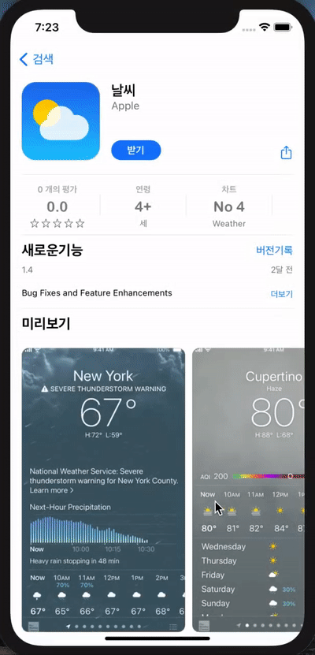

# MyAppStore App

> 애플 Open API를 통해 AppStore 의 검색 페이지 구현
&nbsp;

### Index

- [기능](#기능)
- [설계 및 구현](#설계-및-구현)
- [trouble shooting](#trouble-shooting)
- [학습한 내용](#관련-학습-내용)

---

<p float="left">
  
   
  
</p>

 &nbsp;

---

## 기능

- [키워드 검색](#키워드-검색)
- [검색 결과](#검색-결과)
- [검색어 저장](#검색어-저장)

### 키워드 검색

검색할 키워드로 검색하여 결과를 볼 수 있다


### 검색 결과

검색 결과의 디테일 정보를 확인할 수 있다


### 검색어 저장

저장했던 검색어를 저장하여 다시 재검색 할 수 있다


---

## 설계 및 구현

### View Controller 구성


&nbsp;

### AppStoreViewModel과 View - MVVM

#### SearchPageViewController, DetailViewController - AppStoreViewModel


- ViewModel 의 Closure 사용하여 data 변경사항 캐치하여 data binding 및 UI Update

&nbsp;

### 역할 분배

#### view 관련

| class / struct               | 역할                                                         |
| ---------------------------- | ------------------------------------------------------------ |
| `SearchPageViewController`   | AppStoreViewModel을 이용하여 받은 현재 검색 결과를 테이블뷰 상에 보여준다 |
| `DetailViewController`       | SearchPageViewController에서 넘겨 받은 data값의 디테일 정보를 보여준다  |
| `AppStoreViewModel`          | Request Manager를 이용하여 SearchPageViewController의 검색어에 받는 검색 정보를 요청한다 |


#### Utilities

| class / struct          | 역할                                                         |
| ----------------------- | ------------------------------------------------------------ |
| `Request Manager`       | URLSession을 이용하여 현재 검색어에 대한 정보를 요청함                |
| `OpenWeatherMapService` | - 네트워킹 통한 날씨 예측 정보 가져오기<br />- `WeatherData` 타입으로 json decoding 하기 |
| `WeatherBuilder`        | `WeatherData` → `WeatherViewModel` 이 가진 각 type으로 데이터 가공 |
| `WindDirection`         | 바람의 방향 값(360도 내)을 compass direction으로 변환        |
| `DateConverter`         | 주어진 timezone 을 사용하여 문자열로 된 날짜를 변환해 주는 역할 |

&nbsp;


### 정보 받아오기 & 파싱하기 - 애플 Open API / URLSession / Codable

>  [애플 Open API](https://itunes.apple.com/search?entity=software&country=KR)

- [URLSession 학습한 내용](#url-loading-system)
- Codable
  - `AppStoreModel` 은 `Codable` protocol 을 준수
  - `JSONDecoder` 사용하여 변환

&nbsp;

### 사용자 설정 저장 - UserDefaults

[*관련 학습한 내용*]()

- 마지막으로 검색한 검색어 저장 

UserDefaults 에 사용될 key 관리하는 struct `DataKeys`

&nbsp;

---

## Trouble Shooting

### 검색한 View를 StackView에 쌓아서 보여줄때, View가 새로 보여질때마다 새로운 View가 무한대로 생성되어 오토레이아웃이 깨지게 되는 문제

- 문제상황  
  - StackView안에 쌓아서 보여줘야 하는 재사용 View들이 새롭게 업데이트하여 보여질때마다 무한대로 생성되어 StackView안에 쌓이게 되어 오토레이아웃이 깨지게 됨
- 해결 방법 : **StackView RemoveAllView** 

    - StackView를 새로 쌓을때마다 처음 쌓아줬던 View를 지워줌(extension으로 빼서 사용함)
    
    ```swift
    func removeSubviews(_ views: [UIView]) {
        for view in views {
            self.removeArrangedSubview(view)
            view.removeFromSuperview()
        }
    }
    ```
&nbsp;

### 검색시 Load되는 이미지가 화면이 보여질때마다 계속 요청되는 문제

- 문제상황
  - 검색시 테이블뷰의 이미지와 detailViewController의 스크린샷 이미지가 View가 보여질때마다 재요청되어 UI의 딜레이 생성
- 해결 방법 
  - NSCache
   - NSCache를 이용하여 이미지를 load하고 나서는 이미지캐시로 저장되어 재요청하지 않고 캐시에 저장하여 View가 보여질때마다 이를 반환하도록 구현
   
   ```swift
    static let useCache = NSCache<NSString, UIImage>()
    ```
&nbsp;

### UIStackView의 Distribution 사용

- 문제상황
  - ScrollView위에 StackView를 올려 그 안에 Detail정보를 담은 각 View 객체들을 쌓아주는데, 평소대로 FillEqually를 사용하자 모든 뷰의 사이즈가 다 같아짐
- 해결 방법 
  - Distribution을 EqualSpacing 혹은 FillPropotionally로 바꿔줌

&nbsp;

### 앱의 New Version 출시날짜를 현재 날짜 기준 몇일, 몇주, 몇년 전인지에 대해서 보여줌

- 문제상황
  - open API 에서 제공하는 값은 released Date의 String 값
  - 따라서, 현재 시간과 released Date 사이의 Time Gap을 구해야 함
- 해결방법
  - `TimeInterval`을 이용하여 Time Gap을 구하고 그 값을 기간의 조건에 따라 다르게 보여지도록 함
  
 &nbsp;
 
### 각 View에서 공통적으로 사용될 Rating Star View를 공통 Component 화에 어려움을 

- 문제상황
  - Rating Star가 쓰이는 상황과 타이밍에 따라 별이 filled or empty 되어야 하고, 필요한 별의 갯수도 달라져야함
- 해결방법
  - 별의 Style을 Enum을 사용하여 지정해주고 각각의 type마다 RawValue를 지정해줌
  - init을 이용하여 Rating Star View가 사용되는 상황에 따라 style을 지정하고, 갯수를 count로 받도록 함 
  - API로 제공되는 평점 데이터를 받도록 setData 메서드를 활용하여 평점에 따라 filled Star의 갯수를 지정함
  
&nbsp;


---

## 관련 학습 내용

### URL Loading System

> 표준 인터넷 프로토콜을 사용하여 서버와 url 로 소통하는 방식
URL로 확인할 수 있는 리소스에 접근하는 방식을 URL Loading System 이라 한다.

resource loading 은 **asynchronously** (**비동기**) 로 수행되므로, 유저의 이벤트에 응답할 수 있고 들어오는 데이터나 에러를 처리할 수 있다.

#### URLSession 

> Url 로 request 를 보내거나 받는 일을 담당하는 객체
- 설정 : `URLSessionConfiguration`
  - default 
  - ephemeral
  - background
- `URLSession` instance 는 `URLSessionTask` 인스턴스를 한개 이상 생성하여 사용한다. 
  - GET request 통해 데이터를 받아오는 일 : `URLSessionDataTask`
  - POST / PUT request 통해 파일을 업로드 하는 일 : `URLSessionUploadTask`
  - 원격 서버에서 파일을 다운로드 해오는 일 : `URLSessionDownloadTask`
- Task 상태
  - suspend
  - resume
  - cancel
- URLSession 이 데이터를 반환하는 두가지 방법 (비동기적으로 수행되므로, 끝남을 알리는 방법)
  1. completion handler - task 가 끝날 때 실행됨
  2. delegate 의 method 호출


#### URLComponents

> URL 을 구성하는 요소들을 구조체로 나타냄
- queryItem property : URLQueryItem (name -value 짝으로 구성되어 URL 의 query 부분을 담당)
- url property : 구성요소들로부터 생성된 URL


### 네트워크

데이터를 URL 로부터 가져오려면 

- 어떤 데이터를 주세요 : request
- 응답 : reponse

#### URLSession 활용한 data GET

```swift
func dataTask(with url: URL, 
completionHandler: @escaping (Data?, URLResponse?, Error?) -> Void) -> URLSessionDataTask
```


- `shared` : singleton URLSession instance - 간단한 request 용도

```swift
let task = URLSession.shared.dataTask(with: url) {
	// completion handler
}
```


- Data : bytes or nil(error)
- reponse: reponse 의 구현체. HTTPURLReponse 로 타입 캐스팅 가능
  - HTTPURLResponse의 status code를 이용해 현재 상태코드를 사용할 수 있다(status code: 200-300사이: 확인 및 진행)
- error: error 발생시 값 있음. Nil 이면 성공


- 네트워크 종료시 .resume()


### GCD (Grand Central Dispatch)

Thread 관련 작업은 GCD를 통해 처리하게 됨
Closure로 표현된 특정작업을 특정 Queue에 올려 태우고, 이 Queue를 특정 thread에서 실행하는 작업을 수행함
비동기 수행을 원할 때, main queue(main flow) 말고 다른 수행 queue 로 작업을 보내고 싶을 때 사용

- Dispatch Queue
 - main(serial) : main thread 에서 처리하는 serial-queue, 모든 UI작업은 Main queue에서 수행해야 한다
 - global(concurrent) : 전체 시스템에 공유되는 concurrent queue, 작업의 우선순위를 사전에 정의한 QoS로 정해줌
 - custom : 개발자가 임의로 정의하는 queue

- Quality of Service(QoS)
  - user-interactive : 중요도가 높고 즉각적인 반응이 요구되는 작업을 위해 사용함
  - user-initiated : user-interactive보다는 아니더라도 유저가 빠른 결과를 기대할때 사용함
  - utility : 시간이 다소 오래걸리는 작업을 처리함
  - background : 유저가 인지하지 못하는 뒷단에서 실행되는 작업, user interaction은 없음
  
```swift
var items: [Item]?
DispatchQueue.main.async {
    items = findItems(matching: "News")
}
// async 클로져가 실행 완료 될 때, item 에 값이 할당 된다.
// 선언했다고 해서 작업 완료 시점이 언제인지, 그리고 완료가 될지 안될지는 보장되지 않음
```

network request 같은 무거운 작업을 할 때는 background queue 에서 실행되는게 앱의 main 에서 실행되는것보다 권장됨


### UserDefaults

앱의 data 를 백그라운드 상태 혹은 종료시에도 없어지지 않고 persistent(영구) 보존할 수 있도록 해주는 user default database

- key-value 형태로 저장된다. Key 는 String 만 가능
- 저장 가능한 Value 형태 : NSData, NSString, NSNumber, NSArray, NSDictionary
- 특성
  - UserDefaults 통해 가져온 데이터는 immutable 
  - plist extension 으로 저장됨
  - app launch 될 때, memory 에 올라온다. 
- UserDefaults 변경에 알림을 받고 싶다면
  - didChangeNotification 에 observer 를 등록하면 된다.
